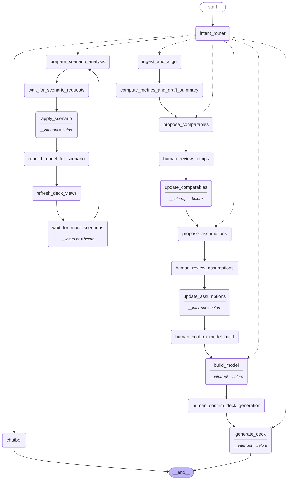

# Workflow Diagram

```mermaid
graph TD;
    __start__([__start__]):::first
    intent_router(intent_router)
    chatbot(chatbot)
    ingest_and_align(ingest_and_align)
    compute_metrics_and_draft_summary(compute_metrics_and_draft_summary)
    propose_comparables(propose_comparables)
    human_review_comps(human_review_comps)
    update_comparables(update_comparables<hr/><small><em>__interrupt = before</em></small>)
    propose_assumptions(propose_assumptions)
    human_review_assumptions(human_review_assumptions)     
    update_assumptions(update_assumptions<hr/><small><em>__interrupt = before</em></small>)
    human_confirm_model_build(human_confirm_model_build)   
    build_model(build_model<hr/><small><em>__interrupt = before</em></small>)
    human_confirm_deck_generation(human_confirm_deck_generation)
    generate_deck(generate_deck<hr/><small><em>__interrupt = before</em></small>)
    refresh_deck_views(refresh_deck_views)
    prepare_scenario_analysis(prepare_scenario_analysis)   
    wait_for_scenario_requests(wait_for_scenario_requests) 
    apply_scenario(apply_scenario<hr/><small><em>__interrupt = before</em></small>)
    rebuild_model_for_scenario(rebuild_model_for_scenario) 
    wait_for_more_scenarios(wait_for_more_scenarios<hr/><small><em>__interrupt = before</em></small>)
    __end__([__end__]):::last
    
    __start__ --> intent_router;
    
    %% Linear Flows
    ingest_and_align --> compute_metrics_and_draft_summary;
    compute_metrics_and_draft_summary --> propose_comparables;
    propose_comparables --> human_review_comps;
    human_review_comps --> update_comparables;
    update_comparables --> propose_assumptions;
    propose_assumptions --> human_review_assumptions;
    human_review_assumptions --> update_assumptions;
    update_assumptions --> human_confirm_model_build;
    human_confirm_model_build --> build_model;
    build_model --> human_confirm_deck_generation;
    human_confirm_deck_generation --> generate_deck;
    
    %% Scenario Loop
    prepare_scenario_analysis --> wait_for_scenario_requests;
    wait_for_scenario_requests --> apply_scenario;
    apply_scenario --> rebuild_model_for_scenario;
    rebuild_model_for_scenario --> refresh_deck_views;
    refresh_deck_views --> wait_for_more_scenarios;
    wait_for_more_scenarios --> prepare_scenario_analysis;
    
    %% Intent Router Conditional Edges
    intent_router -.-> build_model;
    intent_router -.-> chatbot;
    intent_router -.-> generate_deck;
    intent_router -.-> ingest_and_align;
    intent_router -.-> prepare_scenario_analysis;
    intent_router -.-> propose_assumptions;
    intent_router -.-> propose_comparables;
    
    %% End States
    chatbot --> __end__;
    generate_deck --> __end__;
    
    classDef default fill:#f2f0ff,line-height:1.2
    classDef first fill-opacity:0
    classDef last fill:#bfb6fc
```
